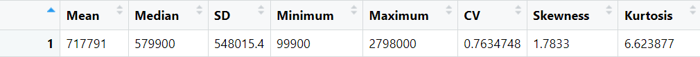
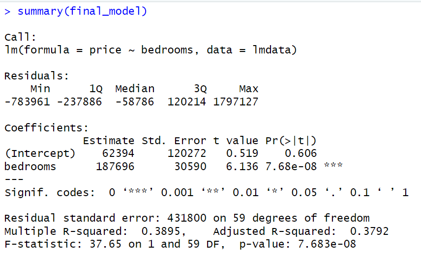
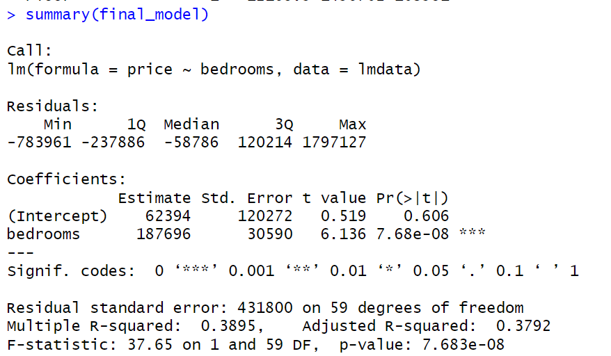

# HomeZilla Data Analytics Project

## 📌 Project Overview
**HomeZilla** offers innovative web-listing services for real estate agents and homebuyers in Canada. This project analyzes user interaction data specifically how users browse property photos to optimize the online viewing experience.

**Objective**: To determine which features of a property list capture the most user attention and to recommend an optimal sequence of photos to maximize engagement.

## 📖 Background
Under the leadership of Sandy Ward, HomeZilla collects detailed data on user interactions, including the duration each photo is viewed. Preliminary findings suggested that longer view times correlate with higher interest. This project moves beyond simple metrics to deeper statistical modeling, aiming to identify specific photo contents (e.g., floor plans, exterior views) that drive engagement.

## 🛠️ Technology Stack
*   **Language**: R
*   **Libraries**: `readxl`, `moments`, `ggplot2`
*   **Tools**: RStudio, Excel

## 📊 Data Description
The analysis utilizes two primary datasets:
1.  **Properties Data**: House prices, square footage, bedrooms, bathrooms, and subtypes.
2.  **Browsing Data**: Timestamps, time viewed, and navigation direction.
    *   *Note*: Merged with a "Tags" dataset containing dummy variables for photo content (e.g., `Floor`, `Kitchen`, `Street`).

## 📈 Analysis & Modeling

### 1. House Price Distribution
We analyzed the distribution of house prices to understand the market segment.
*   **Findings**: The distribution is highly right-skewed with a mean ($717k) significantly higher than the median ($579k).
*   **Normality**: The data deviates significantly from a normal distribution, with high kurtosis (heavy tails).
*   **Modeling**: A stepwise linear regression identified **Bedrooms** as the most significant predictor of price ($R^2 \approx 0.39$).

*Figure 1: Histogram of House Prices showing a right-skewed distribution.*

### 2. Browsing Time Analysis
We examined how long users spend viewing photos (`Time Viewed`).
*   **Distribution**: Extremely right-skewed. Most comparisons are brief (< 2s), but some extend significantly.
*   **Fit**: The data follows an **Exponential Distribution** better than a Normal one, though extreme outliers exist.

*Figure 2: Distribution of View Times.*

### 3. Engagement Modeling (Tags Analysis)
To identify what drives engagement, we performed a backward stepwise regression on `Time Viewed` using dummy variables for photo content.
*   **Goal**: Identify tags that, when removed, significantly increase the AIC (Akaike Information Criterion), indicating their importance.

## 💡 Results & Recommendations

### Key Drivers of Engagement
The analysis identified the following features as the strongest predictors of longer viewing times:
1.  **Floor Plans**: The most influential feature. Users spend the most time studying the layout.
2.  **Exterior/Street Views**: Contextualizing the property is crucial for users.
3.  **Living Areas**: Comfortable spaces (e.g., "Living-Couch", Fireplaces) drive interest.
4.  **Bathrooms**: High-quality bathroom photos also retain attention.

*Figure 3: Stepwise Regression Analysis showing 'Floor' as the most significant variable.*

### Recommended Photo Sequence
Based on the data, we recommend the following photo order for new listings to maximize user retention:
1.  **Floor Plan**: Immediate engagement with the property layout.
2.  **Exterior/Street View**: Establish location and curb appeal.
3.  **Living Room**: Showcase comfort (Fireplace/Couch).
4.  **Bathroom**: Highlight amenities.
